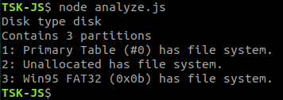

# Image analysis

Performs an analysis to an image file to retrieve if it is an image generated 
using a disk or a partition. If it is a disk, also gets some imformation about 
the partitions inside.

Similar to mmls.

## Example

[include](../../examples/analyze.js)

First we have to import ```TSK``` class. When generating an instance we must 
provide the path of an image. This instance can be used to perform 


The output of this script will be like this:




## Api reference

Can be fount [here](/generated/classes/_index_d_._tsk_js_.tsk.html#analyze).
